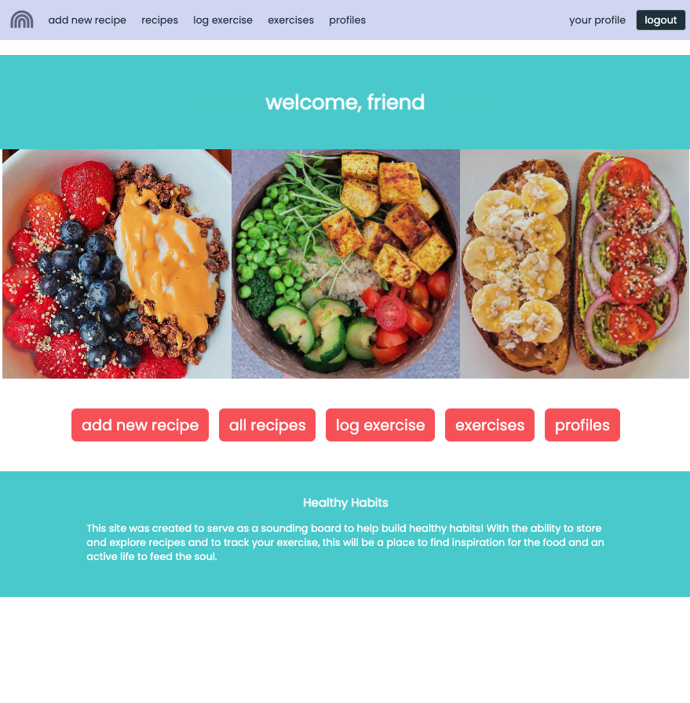
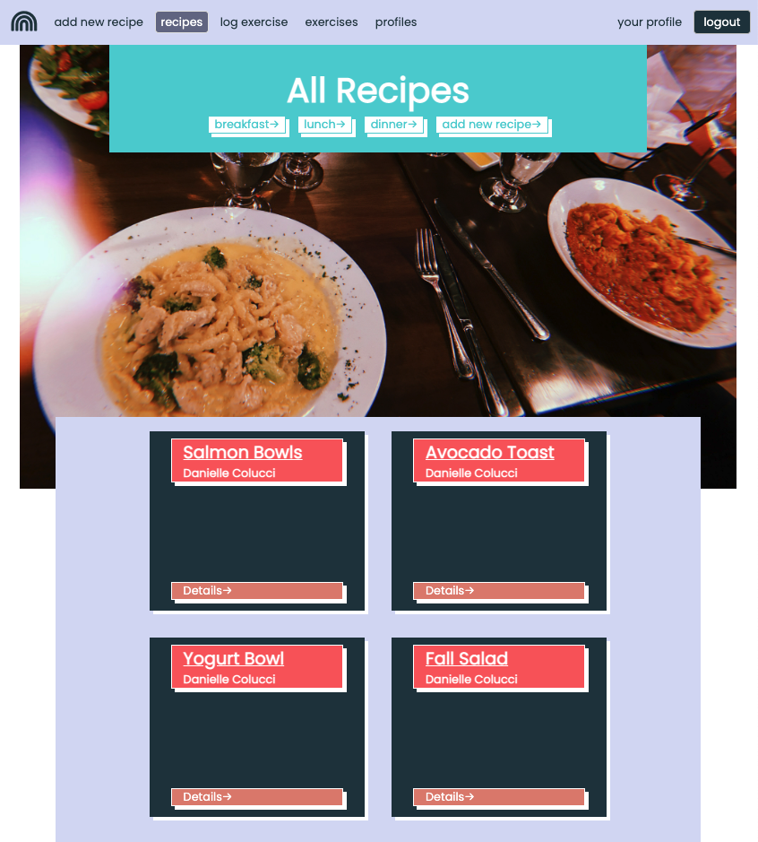
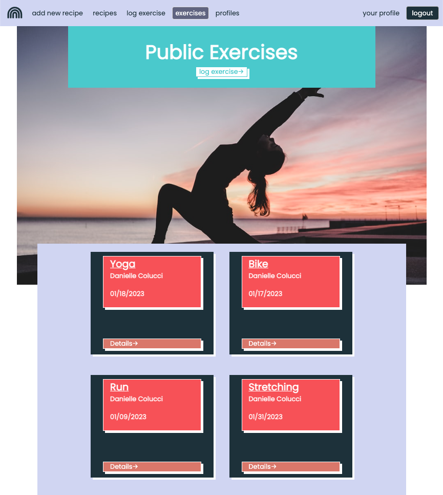

# Healthy Habits

 .  .   

Healthy Habits is a site that was designed with the intention of incouraging the development of habits to encourage wellness. Wellness is as much a state of mind as it is a physical goal, and developing habits is key to maintaining a healthy lifestyle. Health also depends not only on physical exercise, but also an adequate and nutritious diet. It can often feel exhausting, daunting, and isolating trying to incorporate healthy habits into our routines, so this the app serves as a place for both users and guests to explore recipes and exercises to gain inspiration, insight, and community on the journey to creating healthy routines or even just thinking of what to make for dinner or what to do at the gym. Best functionality of the app is experienced when users sign in using a Google account, as users are required to be logged in to create recipes, log exercise, and view other users' profile pages. Owners of recipes and exercise logs have the ability to edit and delete, while other users may only view details of both.  

## Getting Started
[Visit the site here](https://healthy-habits.fly.dev)

[View planning materials here](https://trello.com/b/VOxKvWOq/healthy-habits)

## Technologies Used

- JavaScript 
- Node.js
- Express 
- MongoDB 
- Mongoose 
- EJS
- HTML 
- CSS 
- git 
- fly.io
- Google OAuth

## Attributions 

- Healthy Habits uses the font Poppins, designed by Indian Type Foundry and Jonny Pinhorn; found at Google fonts and available at [GitHub] (https://github.com/itfoundry/poppins)
- Healthy Habits uses a rainbow icon and favicon found at [Font Awesome] (https://fontawesome.com/)

## Ice Box

- [ ] Light/dark mode
- [ ] Daily summary model for the user to log active minutes, time outside, mindful minutes, mood, oz of water, sleep, and additional comments on a particular date (full CRUD functionality)
- [ ] Journal entry model for the user to log journal text content on a particular date (CRD functionality) 
- [ ] Including ice box features, a user should see recipes, exercises, summaries, and journal entries on their own page
- [ ] Including ice box features, a user should see recipes, exercises, and summaries on another user's page 
- [x] Filter recipes by meal category
- [ ] Search for an exercise 
- [ ] Functionality to specify quantity of a particular ingredient